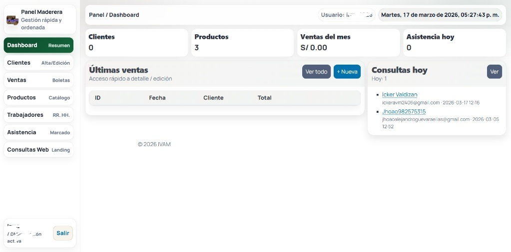

  <h1>Ecosistema Full-Stack: Ventas y Gestión Administrativa</h1>

Este proyecto es una solución integral que conecta una plataforma de ventas (E-commerce) con un panel de control interno (Dashboard). No es solo una web; es una infraestructura que automatiza desde la captura del cliente hasta el registro de la venta y el control del personal.

---

### 🌐 PLATAFORMA EN VIVO

**Interfaz de Usuario (Landing & E-commerce)**
[Ver sitio en producción](https://serviciosgeneralesivam.com/)
*Aquí es donde el cliente interactúa, ve el catálogo y arma sus paquetes de productos*

---

### Arquitectura

* **Backend y Seguridad:** Desarrollado con **PHP** y **PDO** para asegurar conexiones a la base de datos protegidas contra inyecciones SQL.
* **Estructura Modular:** Organización profesional de archivos (`admin`, `api`, `db`) para facilitar el mantenimiento y la escalabilidad.
* **Persistencia de Datos:** Uso de **MySQL** con esquemas relacionales para vincular ventas, inventario y asistencia del personal.
* **Optimización:** Configuración mediante `.htaccess` para manejo de rutas seguras y carga rápida de activos.

---

### Gestión Interna

* **Dashboard de Control:** Panel centralizado con métricas en tiempo real sobre ingresos del mes, stock y flujo de clientes.
* **Motor de E-commerce:** Lógica de precios dinámicos y gestión completa de catálogo directamente desde el administrador.
* **Gestión de RRHH:** Módulo integrado para marcado de asistencia y control de planilla de trabajadores.
* **Sincronización CRM:** Las consultas que entran por la web se reflejan al instante en el tablero administrativo.

---

### 📸 VISTAS TÉCNICAS

**Panel**

---

  Desarrollo enfocado en la automatización de procesos y seguridad de la información.

